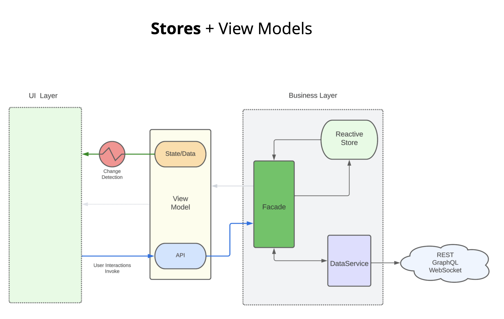

# React + TypeScript + Zustand

This repository demonstrates the benefits of Zustand stores over Redux or other patterns:

[Todo Store](./src/todo/v2/services/todo.store.ts)

### Slides

[React Zustand Patterns](https://slides.com/thomasburleson/react-zustand-patterns?token=nf-ScHfn)

